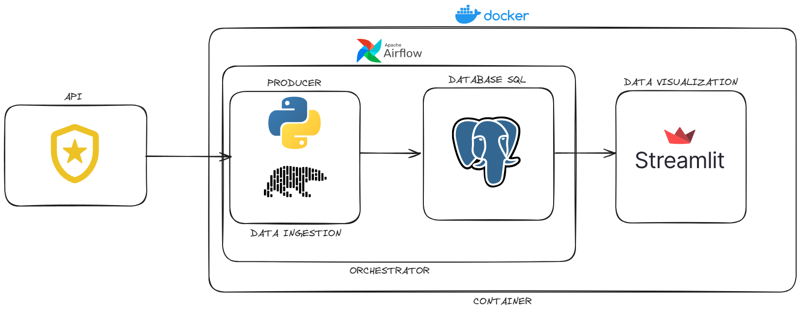

# Engenharia de Dados - Crimes e Acidentes em São Francisco

Status: Em Andamento
Área: Data Engineer

# Descrição

Este projeto tem como objetivo fazer um ciclo completo de um serviço de engenharia de dados simples. O sistema irá consumir dados de uma API pública, armazenar esses dados históricos em um banco de dados estruturado e disponibilizar para o sistema de visualização de dados para análise.

# Arquitetura

# API

[API Oficial](https://www.notion.so/Teste-da-api-do-1Password-env-via-1password-d0fa81daf8fa4b65b356d8cd9b303be6?pvs=21) | [Documentação Oficial](https://datasf.gitbook.io/datasf-dataset-explainers/sfpd-incident-report-2018-to-present)

A fonte de dados escolhida para esse projeto foi uma API pública disponibilizada pelo governo da cidade de São Francisco. Essa API disponibiliza dados do Departamento de Polícia de São Francisco (SFPD). O dataset compila dados do Data Warehouse do departamento de Crimes (CDW) para prover informações nos reports de  acidentes e crimes. 

## Os relatórios de incidentes são a contagem 'oficial' de crimes?

Não. Embora os relatórios de incidentes possam servir como base para estatísticas oficiais de criminalidade, as estatísticas oficiais de criminalidade são regidas pelos programas UCR (Uniform Crime Reporting) e NIBRS (National Incident-Based Reporting System) do FBI. A versão mais recente das estatísticas oficiais UCR/NIBRS divulgadas pela SFPD pode ser encontrada por meio do portal Open Justice do Departamento de Justiça da Califórnia.

## O que são relatórios de incidentes?

Este conjunto de dados inclui relatórios de incidentes registrados a partir de 1º de janeiro de 2018. Esses relatórios são apresentados por policiais ou auto informados por membros do público por meio do sistema de relatórios online da SFPD. Os relatórios são categorizados nos seguintes tipos, com base em como foram recebidos e no tipo de incidente:

- **Relatórios Iniciais**: o primeiro relatório registrado para um incidente.
- **Relatórios Suplementares**: um relatório de acompanhamento a um relatório inicial, Coplogic ou relatório de veículo.
- **Relatórios Coplogic**: relatórios de incidentes apresentados por membros do público usando o sistema de relatórios online da SFPD.
- **Relatórios de Veículos**: relatórios de incidentes relacionados a veículos roubados e/ou recuperados.

Todos os relatórios de incidentes devem ser aprovados por um sargento ou tenente supervisor. Uma vez que um oficial supervisor tenha fornecido aprovação por meio de assinatura eletrônica, nenhuma alteração adicional pode ser feita ao relatório inicial. Se mudanças ou informações adicionais forem necessárias ou descobertas durante uma investigação, um relatório suplementar pode ser gerado para capturar atualizações.

Por exemplo, um relatório suplementar pode ser emitido para indicar uma prisão realizada, uma pessoa desaparecida encontrada ou para fornecer detalhes adicionais de propriedades levadas em um furto. Para diferenciar entre os relatórios iniciais e suplementares, um filtro pode ser aplicado ao campo "Descrição do Tipo de Relatório" ("Report Type Description"). Não filtrar entre os relatórios iniciais e suplementares pode levar à contagem duplicada de incidentes.

O departamento utiliza um protocolo de Transferência Segura de Arquivos (SFTP) para compartilhar dados de incidentes diariamente com o DataSF.

## Múltiplos Códigos de Incidente

Relatórios de incidentes podem ter um ou mais códigos de incidente associados. Por exemplo, um policial pode ter um mandado de prisão e, ao realizar a prisão, descobre narcóticos em posse do indivíduo. O policial registraria dois códigos de incidente: (1) para o mandado e (2) para a descoberta de narcóticos.

Quando existem múltiplos códigos de incidente, o ID do Incidente, o Número do Incidente e os Números CAD permanecem os mesmos, e o campo de ID da Linha pode ser usado como um identificador único para cada linha de dados. Um exemplo é fornecido abaixo.

| Incident Datetime | Row ID | Incident ID | Incident Number | CAD Number | Incident Code | Incident Category |
| --- | --- | --- | --- | --- | --- | --- |
| 1/1/18 13:20 | 61902222223 | 60044 | 180999999 | 180222222 | 62050 | Warrant |
| 1/1/18 13:20 | 61903333320 | 60044 | 180999999 | 180222222 | 16710 | Drug Offense |

## O que não é capturado neste conjunto de dados?

Os relatórios de incidentes não capturam necessariamente todos os dados relacionados à polícia e à criminalidade. Este conjunto de dados não inclui citações (a menos que um relatório de incidente associado tenha sido escrito com a citação). Por exemplo, uma multa por excesso de velocidade rotineira geralmente não requer um relatório de incidente; no entanto, uma multa por excesso de velocidade que revele um motorista com um mandado de prisão resultando em uma prisão exigiria um relatório de incidente.

Este conjunto de dados não inclui nenhuma informação identificável de qualquer pessoa (suspeito, vítima, parte que relata, policial, testemunha, etc.). Este conjunto de dados pode não capturar outros incidentes de agências de aplicação da lei dentro de São Francisco (por exemplo, BART PD, Polícia do Parque Nacional, etc.) ou relatórios não apresentados à SFPD.

As informações citadas acima foram retiradas da documentação oficial da API que podem ser lidas diretamente na página oficial.

[Fonte](https://datasf.gitbook.io/datasf-dataset-explainers/sfpd-incident-report-2018-to-present)

# Tecnologias Escolhidas

Para este projeto foram escolhidas tecnologias open source que tem grande uso no mercado de engenharia de dados, pensando em escalabilidade e barreira de entrada de novos participantes de acordo com os requisitos do projeto.

## Python

A linguagem Python foi escolhida para se fazer o papel de Producer que pegará as informações da fonte e fará a ingestão de dados diretamente no banco de dados relacional que armazenará os dados históricos. A linguagem foi escolhida por ter integrações e ferramentas já amplamente utilizadas pelo mercado de engenharia de dados facilitando as integrações e tarefas que devem ser feitas. As bibliotecas podem ser vistas no arquivo de requirements

Algumas bibliotecas também foram utilizadas para garantir a segurança e qualidade do código feito. Para isso foi utilizado o pre-commit que permite inserir scripts que são executados ao dar um commit no repositório. Os scripts utilzados foram:

### Pylint

O Pylint é uma ferramenta para Python que analisa o código-fonte em busca de erros, verifica o estilo conforme o PEP 8 e promove boas práticas de programação. Ele ajuda  a melhorar a qualidade e a consistência do código Python dando uma nota baseado nas regras definidas de boas práticas para o código que está sendo analisado. Foi definido para esse projeto que códigos com nota abaixo de 8 não serão aceitos nos commits.

### Black

Black é uma ferramenta de formatação automática para código Python. Ela impõe um estilo consistente ao código, eliminando debates sobre formatação. A formatação é aplicada automaticamente, facilitando a padronização e a legibilidade do código.

### Pytest

Pytest é uma biblioteca de testes para Python que oferece uma sintaxe concisa e fácil de usar. Facilita a escrita e execução de testes automatizados, sendo amplamente adotada pela comunidade de desenvolvedores Python.

### Detect-Secrets

Detect-Secrets é uma ferramenta utilizada para detectar informações sensíveis, como senhas, em repositórios de código. Projetada para integração com CI/CD, ajuda a evitar a exposição acidental de segredos nos commits.

## Polars

Polars é uma biblioteca de processamento de dados escrita em Rust, com uma interface para Python. Ela oferece operações de manipulação de dados eficientes e expressivas, sendo especialmente adequada para grandes conjuntos de dados. Polars é projetada para proporcionar desempenho rápido e fácil integração com o ecossistema de ferramentas de ciência de dados em Python. Em resumo, a biblioteca simplifica a análise e manipulação de dados em Python, aproveitando a eficiência do Rust nos bastidores com um desempenho e performance maior que a sua concorrente direta o Pandas. 

Apesar de ainda ser necessário várias melhorias no ambiente do Polars para atingir a maturidade do Pandas, ainda é uma boa escolha para projetos com uma carga de dados maior. Nesse projeto, em específico, não houve ganhos significativos com a escolha do Polars frente ao pandas pelo baixo volume de dados trabalhados e as configurações da máquina da aplicação.

## Apache Airflow

O Apache Airflow é uma plataforma de orquestração de fluxo de trabalho open-source, projetada para automatizar, agendar e monitorar tarefas complexas em pipelines de dados. Desenvolvido em Python, o Airflow permite que os usuários definam, programem e executem fluxos de trabalho como tarefas interativas e direcionadas por código. Sua arquitetura flexível e extensível suporta integrações com várias fontes de dados e ferramentas, permitindo a automação de processos de dados, ETL (Extração, Transformação e Carga), geração de relatórios e outras operações relacionadas ao processamento de dados.

## PostgreSql

O PostgreSQL, é um sistema de gerenciamento de banco de dados relacional open-source. Ele é conhecido por sua robustez, extensibilidade e conformidade com os padrões SQL. O PostgreSQL oferece recursos avançados, como suporte a tipos de dados personalizados, extensões, gatilhos e procedimentos armazenados. Além disso, possui um sólido sistema de controle de concorrência e é altamente escalável, tornando-o adequado para uma variedade de aplicações, desde pequenos projetos até grandes sistemas corporativos. 

Apesar de não ser o tipo ideal para um projeto de DataWarehouse, foi escolhido pela facilidade de uso e integrações e por atender bem o baixo volume de dados trabalhados pela aplicação, considerando que a base de dados não irá crescer exponencialmente, o PostgreSQL atenderá bem os requisitos, com baixo custo e baixa barreira de entrada.

## Streamlit

O Streamlit é uma biblioteca de código aberto em Python que simplifica a criação de aplicativos web interativos para análise de dados e visualização. Projetado para ser fácil de usar, o Streamlit permite que os desenvolvedores transformem rapidamente scripts simples em aplicativos web interativos, sem a necessidade de conhecimentos extensivos em desenvolvimento web.

Com uma abordagem declarativa e minimalista, o Streamlit facilita a criação de aplicativos com widgets interativos, gráficos e tabelas, tudo a partir de um único script Python. Ele oferece suporte a atualizações em tempo real e é integrado perfeitamente com bibliotecas populares de visualização de dados, como Matplotlib, Plotly e Altair.

## Docker

O Docker é uma plataforma de código aberto que facilita a criação, distribuição e execução de aplicativos em contêineres. Os contêineres são unidades leves e independentes que encapsulam um aplicativo e todas as suas dependências, garantindo consistência em diferentes ambientes.

O Docker simplifica o processo de desenvolvimento, implantação e escalabilidade de aplicativos, pois elimina inconsistências entre ambientes de desenvolvimento, teste e produção. Ele permite que os desenvolvedores empacotem um aplicativo com suas dependências em um contêiner, garantindo que o aplicativo execute da mesma maneira em qualquer ambiente onde o Docker esteja instalado.
