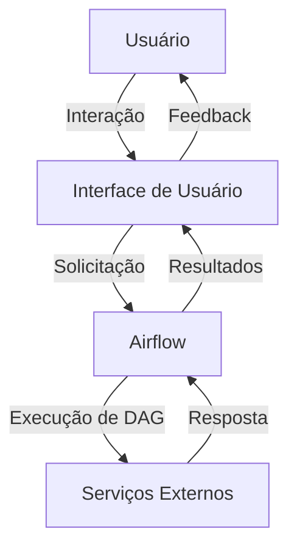

<!-- Generated by weLoveCode Analysis System -->
<!-- Last updated: 2025-09-08T13:18:20.019199 -->
<!-- Analysis type: Architecture -->

# Documentação de Arquitetura do Sistema

## Visão Geral da Arquitetura

Este documento fornece uma visão abrangente da arquitetura do sistema, incluindo componentes principais, padrões de design, decisões tecnológicas, fluxo de dados, interações de serviço, considerações de segurança e aspectos de escalabilidade. As mudanças introduzidas pelo PR recente também são destacadas.

### Estrutura do Repositório

```plaintext
.
├── .gitignore
├── .pre-commit-config.yaml
├── .pylintrc
├── .secrets.baseline
├── LICENSE
├── README.md
├── airflow/
│   ├── __init__.py
│   ├── config/
│   └── dags/
├── docker/
│   ├── .dockerignore
│   ├── docker-compose.yml
│   ├── dockerfile
│   └── requirements.txt
├── images/
│   ├── Architecture.png
│   └── Banner.png
└── tests/
    ├── __init__.py
    ├── test_database.py
    └── test_request.py
```

### Componentes Principais

- **Airflow**: Diretório que contém a configuração e os DAGs (Directed Acyclic Graphs) para orquestração de tarefas.
- **Docker**: Contém arquivos de configuração para containerização, incluindo `docker-compose.yml` e `Dockerfile`.
- **Tests**: Inclui testes unitários para validação de funcionalidades específicas.

### Padrões de Design e Decisões

- **Containerização**: Uso do Docker para garantir a portabilidade e consistência do ambiente de execução.
- **Orquestração de Tarefas**: Utilização do Apache Airflow para gerenciar e executar fluxos de trabalho complexos.

### Stack Tecnológico e Dependências

- **Docker**: Para containerização e gerenciamento de ambientes.
- **Apache Airflow**: Para orquestração de tarefas.
- **Python**: Linguagem principal para desenvolvimento de scripts e testes.

### Fluxo de Dados e Interações de Serviço



### Considerações de Segurança

- **.secrets.baseline**: Arquivo para gerenciamento de segredos e credenciais sensíveis.
- **Configurações de Rede**: Definidas no `docker-compose.yml` para isolar serviços e limitar o acesso externo.

### Aspectos de Escalabilidade

- **Escalabilidade Horizontal**: Possibilidade de escalar serviços através de múltiplas instâncias de containers.
- **Gerenciamento de Recursos**: Configurações no `docker-compose.yml` para otimizar o uso de recursos.

## Mudanças Arquiteturais Introduzidas pelo PR

### Atualizações no `docker-compose.yml`

- **Modificações**: 22 alterações para otimizar a configuração de serviços e redes.
- **Impacto**: Melhorias na eficiência e segurança do ambiente de execução.

### Novos Documentos Adicionados

- **ANALYSIS_SUMMARY.md**: Resumo das análises de negócios e técnicas.
- **ARCHITECTURE.md**: Documento atual de arquitetura.
- **BUSINESS_ANALYSIS.md**: Análise de requisitos e objetivos de negócios.
- **DATA_MODEL.md**: Descrição do modelo de dados utilizado no sistema.

## Conclusão

Este documento de arquitetura fornece uma visão clara e detalhada do sistema, destacando os componentes principais, padrões de design, e mudanças recentes. A estrutura modular e o uso de tecnologias modernas como Docker e Airflow garantem um sistema robusto, escalável e seguro.

---
*This analysis was automatically generated by the weLoveCode PR Analysis System*
