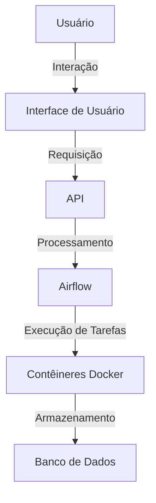

<!-- Generated by weLoveCode Analysis System -->
<!-- Last updated: 2025-09-08T13:18:12.475168 -->
<!-- Analysis type: Architecture -->

```markdown
# Documentação de Arquitetura do Sistema

## Visão Geral da Arquitetura

Este documento descreve a arquitetura do sistema, incluindo seus componentes principais, padrões de design, decisões tecnológicas, fluxo de dados, interações de serviço, considerações de segurança e aspectos de escalabilidade. As mudanças introduzidas pelo PR atual também são destacadas.

## Estrutura do Repositório

O repositório está organizado da seguinte forma:

- **.gitignore**: Arquivo de configuração para ignorar arquivos no controle de versão.
- **.pre-commit-config.yaml**: Configuração para hooks de pré-commit.
- **.pylintrc**: Configuração para o Pylint.
- **.secrets.baseline**: Arquivo de configuração para detecção de segredos.
- **LICENSE**: Licença do projeto.
- **README.md**: Documento de introdução e instruções gerais.
- **airflow/**: Diretório contendo configurações e DAGs do Apache Airflow.
  - **config/**: Configurações específicas do Airflow.
  - **dags/**: Definições de DAGs para orquestração de tarefas.
- **docker/**: Configurações relacionadas ao Docker.
  - **.dockerignore**: Arquivo para ignorar arquivos no contexto do Docker.
  - **docker-compose.yml**: Configuração para orquestração de contêineres Docker.
  - **dockerfile**: Definição de imagem Docker.
  - **requirements.txt**: Dependências de pacotes Python.
- **images/**: Imagens utilizadas na documentação.
  - **Architecture.png**: Diagrama da arquitetura.
  - **Banner.png**: Banner do projeto.
- **tests/**: Testes automatizados do sistema.
  - **test_database.py**: Testes relacionados ao banco de dados.
  - **test_request.py**: Testes relacionados a requisições.

## Componentes Principais

### Apache Airflow
- **Descrição**: Utilizado para orquestração de tarefas e fluxos de trabalho.
- **Localização**: Diretório `airflow/`.

### Docker
- **Descrição**: Utilizado para containerização e orquestração de serviços.
- **Arquivos Relevantes**: `docker/docker-compose.yml`, `docker/dockerfile`.

## Padrões de Design e Decisões

- **Containerização**: Uso do Docker para garantir consistência entre ambientes de desenvolvimento e produção.
- **Orquestração de Tarefas**: Uso do Apache Airflow para gerenciar fluxos de trabalho complexos.

## Pilha Tecnológica e Dependências

- **Python**: Linguagem principal para desenvolvimento.
- **Docker**: Para containerização.
- **Apache Airflow**: Para orquestração de tarefas.
- **Arquivos de Configuração**: `.pylintrc`, `.pre-commit-config.yaml`, `requirements.txt`.

## Fluxo de Dados e Interações de Serviço

- **Fluxo de Dados**: Os dados são processados através de DAGs definidos no Airflow, que orquestram tarefas em contêineres Docker.
- **Interações de Serviço**: Os serviços interagem principalmente através de APIs e tarefas orquestradas pelo Airflow.

## Considerações de Segurança

- **Detecção de Segredos**: Uso de `.secrets.baseline` para identificar e gerenciar segredos no código.
- **Isolamento de Contêineres**: Uso do Docker para isolar serviços e minimizar riscos de segurança.

## Aspectos de Escalabilidade

- **Escalabilidade Horizontal**: Possibilidade de escalar serviços adicionando mais instâncias de contêineres.
- **Gerenciamento de Tarefas**: Airflow permite escalabilidade no gerenciamento de tarefas através de sua arquitetura distribuída.

## Mudanças Arquiteturais Introduzidas pelo PR

- **Atualização do `docker-compose.yml`**: Foram feitas 22 alterações para melhorar a configuração de orquestração de contêineres.
- **Adição de Documentação**: Novos documentos foram adicionados para análise de arquitetura, análise de negócios e modelo de dados, fornecendo uma base mais sólida para o entendimento do sistema.

## Diagramas

### Diagrama de Arquitetura



Este diagrama ilustra a interação entre os componentes principais do sistema, destacando o fluxo de dados e a orquestração de tarefas.

---

Este documento fornece uma visão abrangente da arquitetura do sistema, incorporando as mudanças recentes e estabelecendo uma base sólida para futuras atualizações e manutenções.
```

---
*This analysis was automatically generated by the weLoveCode PR Analysis System*
