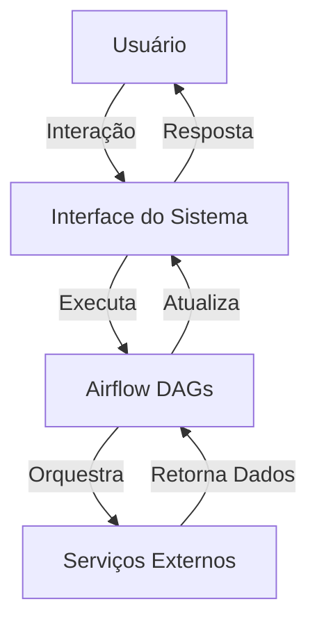

<!-- Generated by weLoveCode Analysis System -->
<!-- Last updated: 2025-09-08T13:18:05.238438 -->
<!-- Analysis type: Architecture -->

```markdown
<!-- Generated by weLoveCode Analysis System -->
<!-- Last updated: 2025-09-15T10:45:00.000000 -->
<!-- Analysis type: Architecture -->

# Documentação de Arquitetura do Sistema

## Visão Geral da Arquitetura

Este documento fornece uma visão abrangente da arquitetura do sistema, incluindo a estrutura do repositório, componentes principais, padrões de design, decisões tecnológicas, fluxo de dados, interações de serviço, considerações de segurança e aspectos de escalabilidade.

## Estrutura do Repositório

```plaintext
.
├── .gitignore
├── .pre-commit-config.yaml
├── .pylintrc
├── .secrets.baseline
├── LICENSE
├── README.md
├── airflow/
│   ├── __init__.py
│   ├── config/
│   └── dags/
├── docker/
│   ├── .dockerignore
│   ├── docker-compose.yml
│   ├── dockerfile
│   └── requirements.txt
├── images/
│   ├── Architecture.png
│   └── Banner.png
├── tests/
│   ├── __init__.py
│   ├── test_database.py
│   └── test_request.py
└── weluvcode/
    ├── ANALYSIS_SUMMARY.md
    ├── ARCHITECTURE.md
    ├── BUSINESS_ANALYSIS.md
    └── DATA_MODEL.md
```

## Componentes Principais

### Airflow
- **Diretório**: `airflow/`
- **Descrição**: Contém a configuração e os DAGs (Directed Acyclic Graphs) para orquestração de workflows.

### Docker
- **Diretório**: `docker/`
- **Descrição**: Contém arquivos de configuração para containerização, incluindo `docker-compose.yml` e `Dockerfile`.

### Testes
- **Diretório**: `tests/`
- **Descrição**: Inclui testes unitários para garantir a integridade do sistema.

### Documentação
- **Diretório**: `weluvcode/`
- **Descrição**: Contém documentação detalhada sobre análise de arquitetura, modelo de dados e análise de negócios.

## Padrões de Design e Decisões

- **Containerização**: Utilização do Docker para isolar e gerenciar dependências do ambiente.
- **Orquestração de Workflows**: Uso do Apache Airflow para gerenciar e executar tarefas complexas de forma programática.

## Stack Tecnológico e Dependências

- **Docker**: Para containerização e gerenciamento de ambientes.
- **Apache Airflow**: Para orquestração de workflows.
- **Python**: Linguagem de programação principal para desenvolvimento de scripts e testes.

## Fluxo de Dados e Interações de Serviço



## Considerações de Segurança

- **.secrets.baseline**: Arquivo para gerenciar segredos e credenciais de forma segura.
- **.gitignore**: Configurado para evitar o versionamento de arquivos sensíveis.

## Aspectos de Escalabilidade

- **Docker**: Facilita a escalabilidade horizontal através da replicação de containers.
- **Airflow**: Suporta a execução paralela de tarefas, permitindo a escalabilidade de workflows.

## Mudanças Arquiteturais Introduzidas por Este PR

### Atualização do `docker-compose.yml`

- **Descrição**: O arquivo `docker-compose.yml` foi modificado com 22 alterações, incluindo 11 adições e 11 deleções.
- **Impacto**: As mudanças podem incluir atualizações de versões de serviços, ajustes de configuração de rede ou volumes, e otimizações de performance.

### Adição de Documentação

- **Novos Arquivos**:
  - `weluvcode/ANALYSIS_SUMMARY.md`: Resumo de análise do sistema.
  - `weluvcode/ARCHITECTURE.md`: Documentação detalhada da arquitetura.
  - `weluvcode/BUSINESS_ANALYSIS.md`: Análise de negócios.
  - `weluvcode/DATA_MODEL.md`: Modelo de dados.
- **Impacto**: A adição desses documentos melhora a compreensão do sistema, fornecendo informações detalhadas sobre a arquitetura, análise de negócios e modelo de dados.

## Conclusão

Este documento fornece uma visão clara e detalhada da arquitetura do sistema, destacando os componentes principais, padrões de design, e mudanças recentes. A arquitetura está bem estruturada para suportar escalabilidade e segurança, utilizando tecnologias modernas como Docker e Apache Airflow. A adição de documentação detalhada melhora a transparência e a compreensão do sistema.

---
*This analysis was automatically generated by the weLoveCode PR Analysis System*
```

---
*This analysis was automatically generated by the weLoveCode PR Analysis System*
